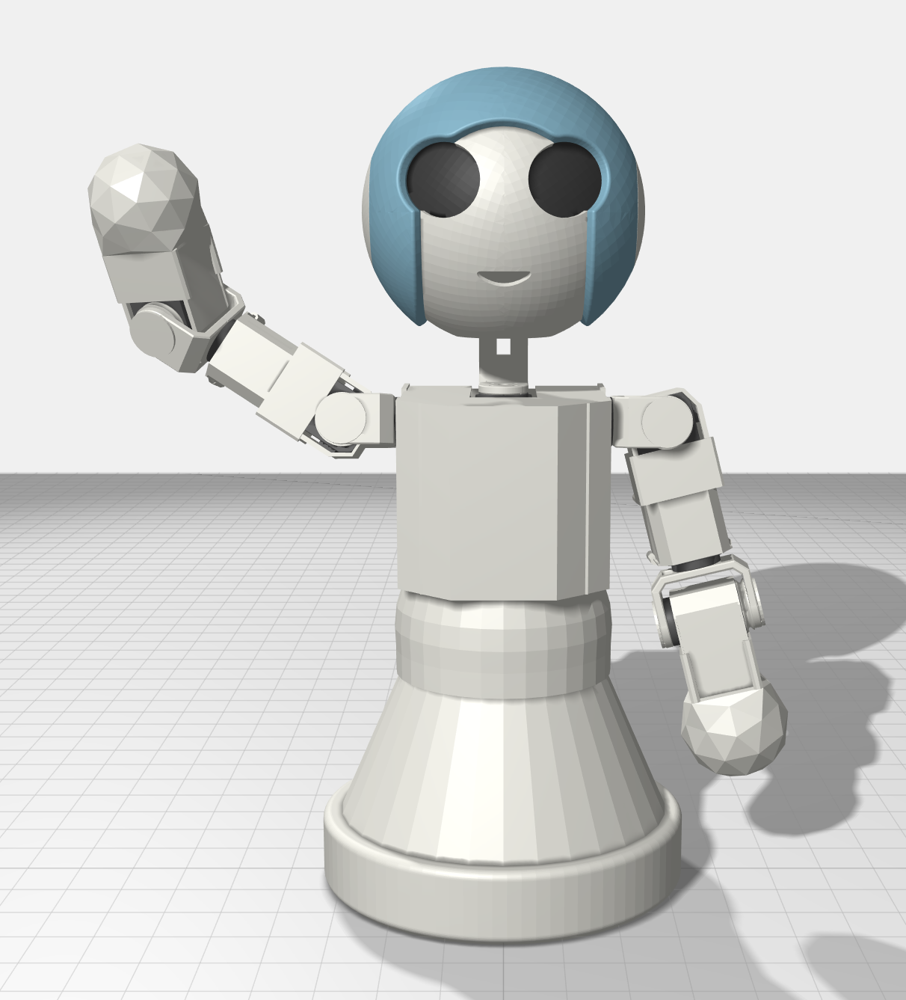
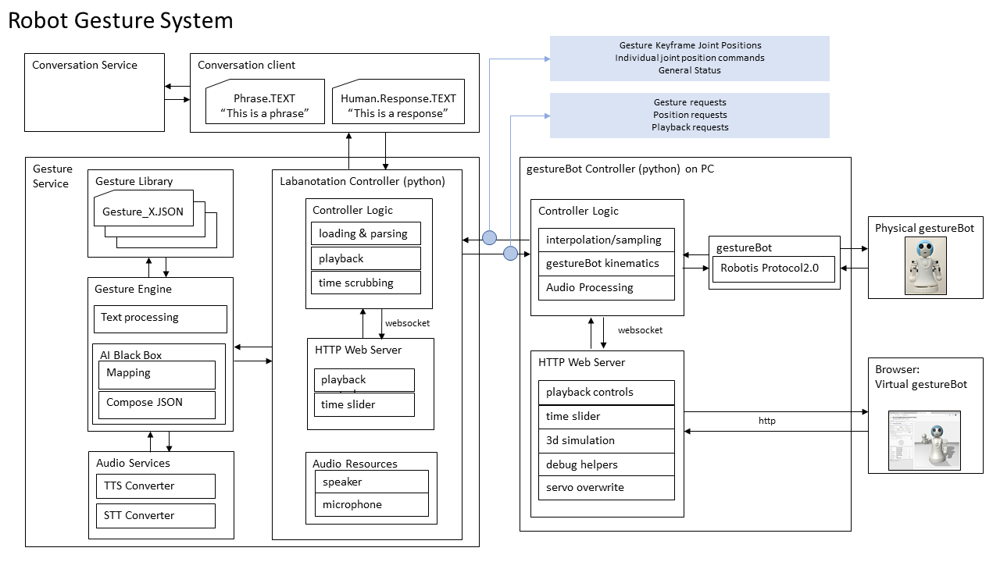

##  [Microsoft Applied Robotics Research Library](https://special-giggle-b26bab5f.pages.github.io/)
### Open Source Samples for Service Robotics
[](https://opensource.org/licenses/MIT)  

# gestureBot Design Kit
Welcome! This gestureBot Design Kit repository  contains all the information needed to build both a virtual and physical desktop companion robot. Along with other tools in the Labanotation Suite, the gestureBot can be used to create and edit gestures documented in the Labanotation format and see them performed by a robot.  

A Windows 10 PC is required to run the software and the virtual robot. The physical robot can be built using a desktop 3D-printer and about **$350(USD)** in electronic servos and parts.

The kit contains a browser-based simulated robot with control software based on the [Robotis XL](https://www.robotis.us/dynamixel-xl-320/) series of servo motors. To construct a physical robot, it provides models for 3D-printable body-parts, a parts-list and purchase links for electronic components, and step-by-step assembly instructions. No soldering is required, but some manual skill is needed to mate small electronic connectors, manipulate small plastic rivets, and install miniature metal screws to assemble the body components.



## What is the gestureBot and who might be interested in using this kit?
The gestureBot is a semi-humanoid service-robot capable of mimicking human gestures. Its purpose is to support research and education in the field of ***Human-Robot-Interaction (HRI)***. Its function is to physically and virtually render gestures stored in a digital Labanotation format. The designation "semi-humanoid" means that it has some but not all of the limbs and joints of a human form. The designation **"service-robot"** refers to a requirement that is designed to safely operate directly with humans, as opposed to an **"industrial-robot"** that usually repeats tasks within a cordoned-off safety zone. The gestureBot was adapted from a project originally created by interns working for Microsoft Research Asia. We've built on their work and put together this design kit to help students learn with a fun hand's-on project that provides exposure to key technologies used in service-robotics. Researchers in the field of HRI can use the kit to support experimentation in the use of gestures to enhance robot-to-human comunication.

No matter where your interest lies, we hope you find the gestureBot Design Kit a fun and easy way to work and learn in the field of robotics.

# How It Works
## System Diagram


## System Modules:

### **Gesture Service**

#### **Labanotation Controller**
The Labanotation Controller reads .json files containing gestures described in Labanotation format, which are recordings of human gestural movements reduced to significant keyframes consisting of sequenced joint position and movement timing goals. Gesture selection and loading, as well as joint positional movements and their durations contained in the gestures, are requested by and sent to the gestureBot Controller module. The keyframes can also be transmitted under the control of simple play/pause commands and a scrubbing timeline with a browser-based UI available on **http port 8000**.

#### **Gesture Library**
The [**Gesture Library**](./src/Labanotation/README.md) is a database of gesture-concept pairs expressed in Labanotation format and stored as .json files. The data is directly accessed by the Gesture Engine.  The library includes a complete listing of the sample database including a video clip of each gesture performed by the gestureBot.

#### **Gesture Engine**
For humanoid robot performance, the Gesture Engine contains a software module constructed with Python and Google's neural network [**word2vec**](https://code.google.com/archive/p/word2vec/#!). It receives text phrases from the Labanotation Controller as input and returns corresponding gestures. Sample text phrases and gesture-concept pairs contained in the Gesture Library can be previewed by the system with a browser-based UI available on **http port 8002**.

### **gestureBot Controller**
The gestureBot Controller requests from the Labanotation Controller gestures to be loaded and played. Optionally, it will interpolate and insert interstitial keyframes between Labanotation keyframes in a gesture at a selectable sampling rate. It transforms goal positions and times contained in the keyframes into joint servo commands calculated using information specific to the the gestureBot's physical characteristics. It animates both the real and models of the robot using the servo commands and a library of virtual model assets. Finally, it provides a browser-based user interface on **http port 8001** for:
*   Selecting a Gesture-Concept .json input file for rendering
*   Optionally setting a sample rate for interstitial keyframe extrapolations between Labanotation keyframes
*   Optionally showing keyframe goal positions with "bone segments" within the browser-hosted model
*   Optionally hide cover components in the browser-hosted model
*   Direct override control for individual servos in the gestureBot
*   Previewing a gesture or movement in a simple simulator
*   Reporting application status with console messages

### **Real and Simulated gestureBots**
Both physical gestureBots and virtual models hosted in a browser connect to the gestureBot controller and receive movement commands as servo-control packets. The packets adhere to the [Robotis Dynamixel 2.0 Protocol](https://emanual.robotis.com/docs/en/dxl/x/xl320/). A packet is sent for each Labanotation and interstitial keyframe transmitted by the gestureBot Controller and contains individual goal positions and movement durations for each servo in the gestureBot.

# Install, Build and Run
- [Software Installation Instructions ](./src/Samples/gestureService_w2v/README.md) for the controller applications
- [Step-by-Step Instructions ](./hardware/README.md) for constructing a physical gestureBot

# Contributing
We think the gestureBot can be made to do much more than render gestures and we hope you will help it evolve! We have designed the hardware and software to be easy to understand and modify.
- Please read our [short and sweet coding guidelines](coding_guidelines.md).
- For big changes such as adding new feature or refactoring, [file an issue first](https://github.com/Microsoft/gestureBotDesignKit/issues).
- Use our [recommended development workflow](dev_workflow.md) to make changes and test it.
- Use [usual steps](https://akrabat.com/the-beginners-guide-to-contributing-to-a-github-project/) to make contributions just like other GitHub projects. If you are not familiar with Git Branch-Rebase-Merge workflow, please [read this first](http://shitalshah.com/p/git-workflow-branch-rebase-squash-merge/).

## Checklist
- Use same style and formatting as rest of code even if it's not your preferred one.
- Change any documentation that goes with code changes.
- Do not include OS specific header files or new 3rd party dependencies.
- Keep your pull request small, ideally under 10 files.
- Don't don't include large binary files.
- When adding new includes, make sure the dependency is absolutely necessary.
- Rebase your branch frequently with master (once every 2-3 days is ideal).
- Make sure your code compiles on Windows, Linux and OSX.

## FAQ

*   **Q** *Who should I contact regarding this repository?*

*   **A** Please create a Github issue or email [robosupp@microsoft.com](mailto:robosupp@microsoft.com) with any questions or feedback.

*   **Q** *How challenging is this project for children?*

*   **A** We think it depends on the child and how much support they receive!  We'd love to attract kids who love Minecraft and/or Legos, but we've shaped this project to be easily accessible to high-school and college STEM faculty looking for affordable lab projects, academic HRI researchers, and casual hobbyists.

*   **Q** *How does this project relate to Artificial Intelligence (AI)?*

*   **A** Physics-based simulation of real robots in virtual environments opens the door for the use of AI "brain" training using Reinforcement Learning tool-chains such as [Microsoft Bonsai](https://bons.ai).

## Citation

If you want to cite this work, please use the following bibtex code

```
@Article{Ikeuchi2018,
author="Ikeuchi, Katsushi
and Ma, Zhaoyuan
and Yan, Zengqiang
and Kudoh, Shunsuke
and Nakamura, Minako",
title="Describing Upper-Body Motions Based on Labanotation for Learning-from-Observation Robots",
journal="International Journal of Computer Vision",
year="2018",
month="Dec",
day="01",
volume="126",
number="12",
pages="1415--1429",
issn="1573-1405",
doi="10.1007/s11263-018-1123-1",
url="https://doi.org/10.1007/s11263-018-1123-1"
}
```

If you want to learn more about creating good readme files then refer the following [guidelines](https://docs.microsoft.com/en-us/azure/devops/repos/git/create-a-readme?view=azure-devops). You can also seek inspiration from the below readme files:
- [ASP.NET Core](https://github.com/aspnet/Home)
- [Visual Studio Code](https://github.com/Microsoft/vscode)
- [Chakra Core](https://github.com/Microsoft/ChakraCore)
