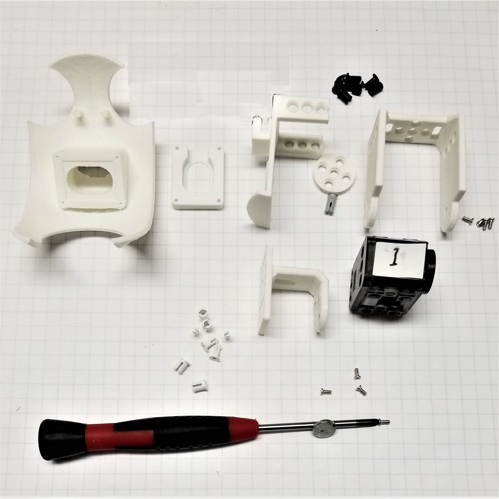
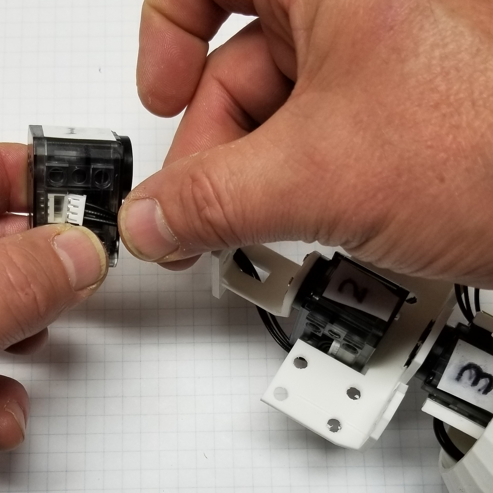
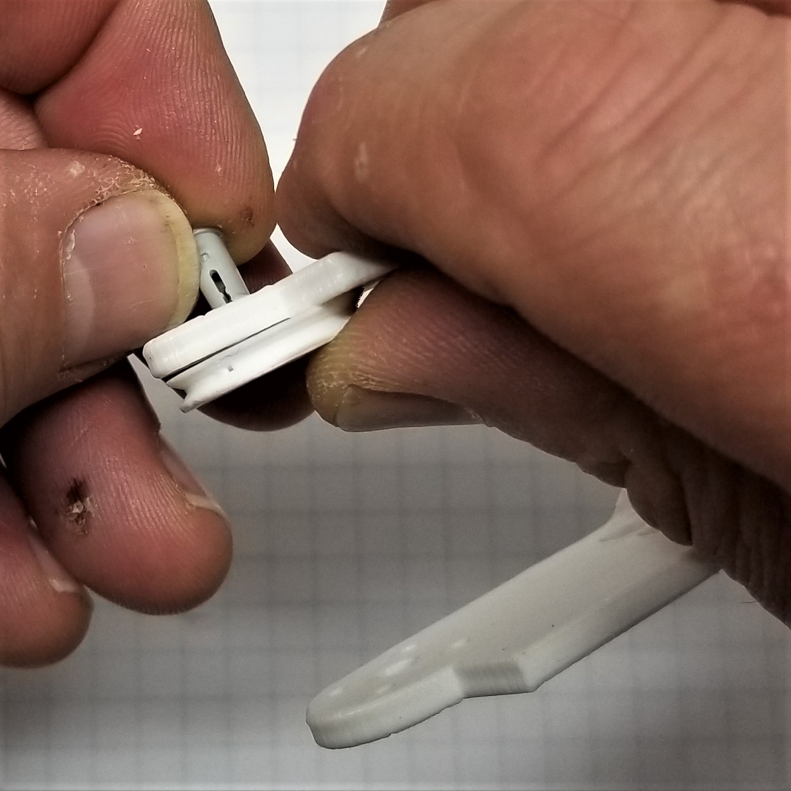

##  [Microsoft Applied Robotics Research Library](https://special-giggle-b26bab5f.pages.github.io/)
### Open Source Samples for Service Robotics
  
# [gestureBot Construction Guide](../hardware/README.md)

## **Session 4:** Assemble the Head Structure
In this session we will 3D-print the components for both arms while assembling the structural components of the gestureBot's head.

### Parts: 
- servo labeled ID:001 programmed in Session 2
- 130MM servo cable
- (22) short plastic rivets
- (5) long plastic rivets
- (8) 3mm miniature steel screws
- [Neck](https://github.com/microsoft/gestureBotDesignKit/blob/main/hardware/3D_print/gb_Neck.stl) 3D-printed in Session 3, the neck is connected to servo ID:002 that rotates horizontally allowing the gestureBot to turn its head and servo ID:001.
- [Head Swing Bracket](https://github.com/microsoft/gestureBotDesignKit/blob/main/hardware/3D_print/gb_SwingBracket_Head.stl) 3D-printed in Session 3, the head swing bracket and servo wheel are attached to servo ID:001 that rotates vertically allowing the gestureBot to look up and down.
- [Servo Wheel](https://github.com/microsoft/gestureBotDesignKit/blob/main/hardware/3D_print/gb_ServoWheel.stl) 3D-printed in Session 3, the servo wheel supports servo ID:001 in the head swing bracket.
- [Head Frame](https://github.com/microsoft/gestureBotDesignKit/blob/main/hardware/3D_print/gb_HeadFrame.stl) 3D-printed in Session 3, the head frame attaches to the head swing bracket and provides a mount point for the speaker and face components.
- [Face](https://github.com/microsoft/gestureBotDesignKit/blob/main/hardware/3D_print/gb_Face.stl) 3D-printed in Session 3, the face connects to the head frame and provides a mount point for the speaker and the eyes.
- [Speaker](https://github.com/microsoft/gestureBotDesignKit/blob/main/hardware/3D_print/gb_Speaker.stl) 3D-printed in Session 3, the speaker is a mounting component intended as a placeholder for a speakspeaker modification in the future.

### Tools: 
- PH0 Phillips screwdriver
- plastic rivet tool

### **Procedure:**

#### **First, start 3D-printing the parts required for both arm assemblies:**
- [(4) Screw Mount Swing Bracket](https://github.com/microsoft/gestureBotDesignKit/blob/main/hardware/3D_print/gb_SwingBracket.stl)
- [(4) Servo Wheel](https://github.com/microsoft/gestureBotDesignKit/blob/main/hardware/3D_print/gb_ServoWheel.stl)
- [(6) Servo Mount Plate](https://github.com/microsoft/gestureBotDesignKit/blob/main/hardware/3D_print/gb_ServoMountPlate.stl)

#### **Second, assemble the head structure:**
- Mount the neck to the horn () of servo ID:002, taking care to align the tick-marks of the servo cover, the horn, and the neck component.

- Route the 130mm cable from servo ID:002 through the holes in the neck.

- Connect the 130mm cable to servo ID:001.

- Mount servo ID:001 to neck with (4) rivets.

- Mount the speaker component and head frame to face with (4) M1 10mm machine screws.

- Attach servo wheel to head swing bracket with long rivet. Do not install the rivet pin to allow the servo wheel to rotate freely.

- Install servo ID:001 to head swing bracket taking care to align servo horn tick-mark with tick-mark on bracket.

- Mount face frame to head swing bracket with (4) long rivets. Installing the rivet pins is not recommended to accomodate future modifications and disassembly.

- Inspect the gestureBot torso and head structure assemblies.

## [**Next-> Session 5:** Assemble the Right Arm](Session05.md)

