##  [Microsoft Applied Robotics Research Library](https://special-giggle-b26bab5f.pages.github.io/)
### Open Source Samples for Service Robotics
  
# [gestureBot Construction Guide](../hardware/README.md)

## **Session 7:** Attach the Arms and Test the Servos
In this session we will 3D-print the hood component (in an alternate color if desired) while we attach the arms to the torso and test the servos using the Robotis Dynamixel Wizard 2.0 application.

### Parts: 
- controller electronics assembly completed in [Session 1](Session01.md)
- head and torso completed in [Session 4](Session04.md)
- right arm assembly completed in [Session 5](Session05.md)
- left arm assembly completed in  [Session 6](Session06.md)
- (2) 190MM servo cables
- (24) short plastic rivets
- [(2) Servo Mount Plate](https://github.com/microsoft/gestureBotDesignKit/blob/main/hardware/3D_print/gb_ServoMountPlate.stl) 3D-printed in Session 4, the servo mount plates support servos' ID:005 and ID:009 (from the arm assemblies) attachment to the upper torso frame.
- [Base](https://github.com/microsoft/gestureBotDesignKit/blob/main/hardware/3D_print/gb_Base.stl) 3D-printed in Session 4, the base supports the entire gestureBot. The tabs on the bottom of the base frame insert into the base to provide a stable platform as well as space to contain the controller electronics and USB3 hub.

### Tools: 
- plastic rivet tool

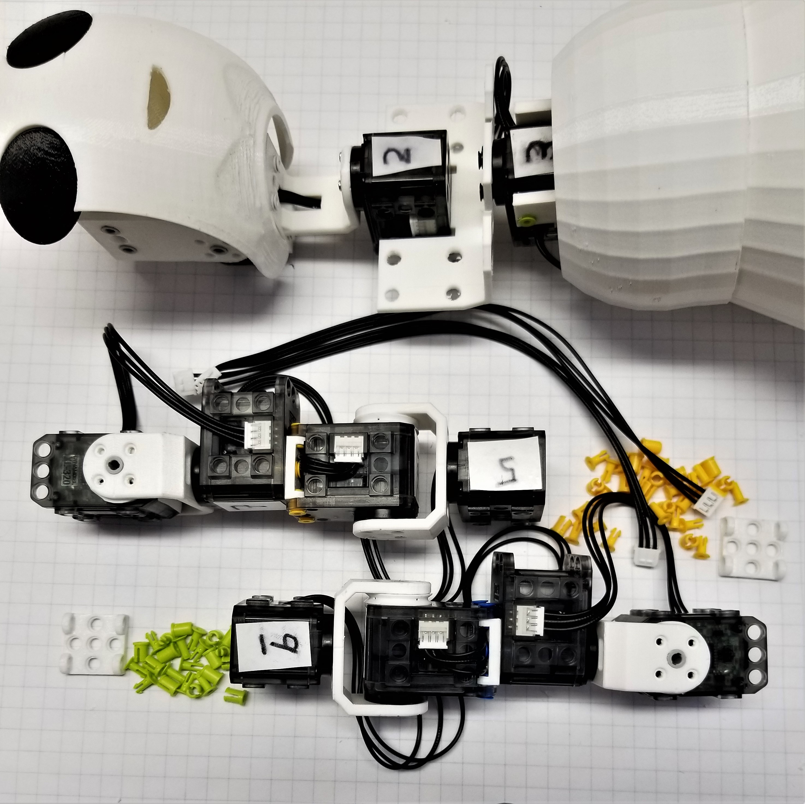
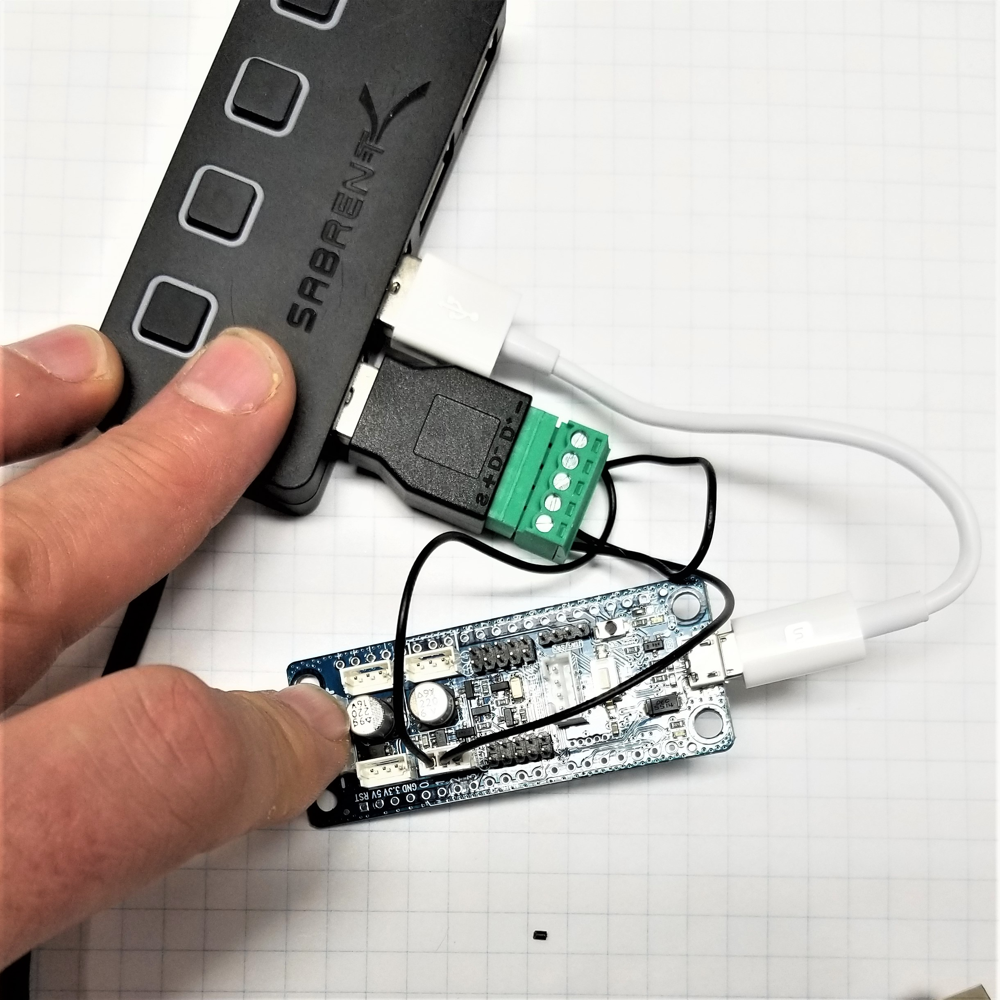

### **Procedure:**

#### **First, start 3D-printing the parts required for future sessions:**
- [Hood (use alternative color plastic if desired)](https://github.com/microsoft/gestureBotDesignKit/blob/main/hardware/3D_print/gb_Hood.stl)

#### **Second, attach the arms to the torso:**
- Attach the mount plate to servo ID:005 in the **right** arm assembly using (4) short rivets.

- Attach the mount plate to servo ID:009 in the **left** arm assembly using (4) short rivets.

- Route the cable connecting servo ID:005 and ID:006 through the space between the bottom-rear rivet mount holes of servo ID:005.

- Mount the right arm assembly to the upper torso frame using (8) short rivets.

- Route the cable connecting servo ID:009 and ID:010 through the space between the bottom-rear rivet mount holes of servo ID:009.

- Mount the left arm assembly to the upper torso frame using (8) short rivets.
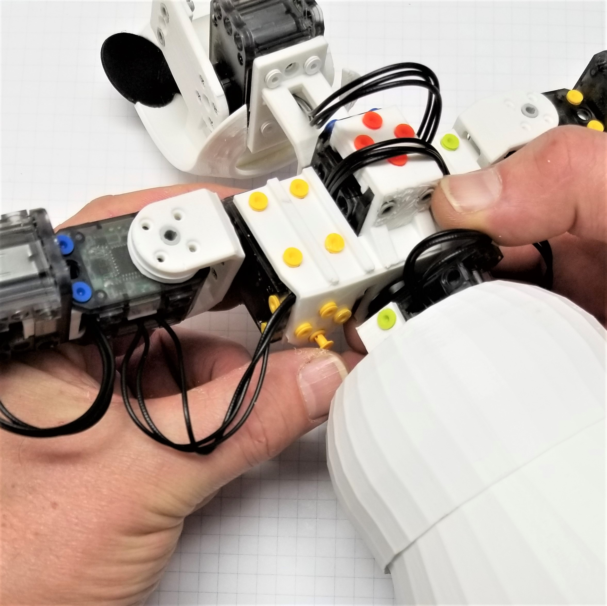

- Connect the (2) 190mm cables to the front-side connectors of servos ID:005 and ID:009.
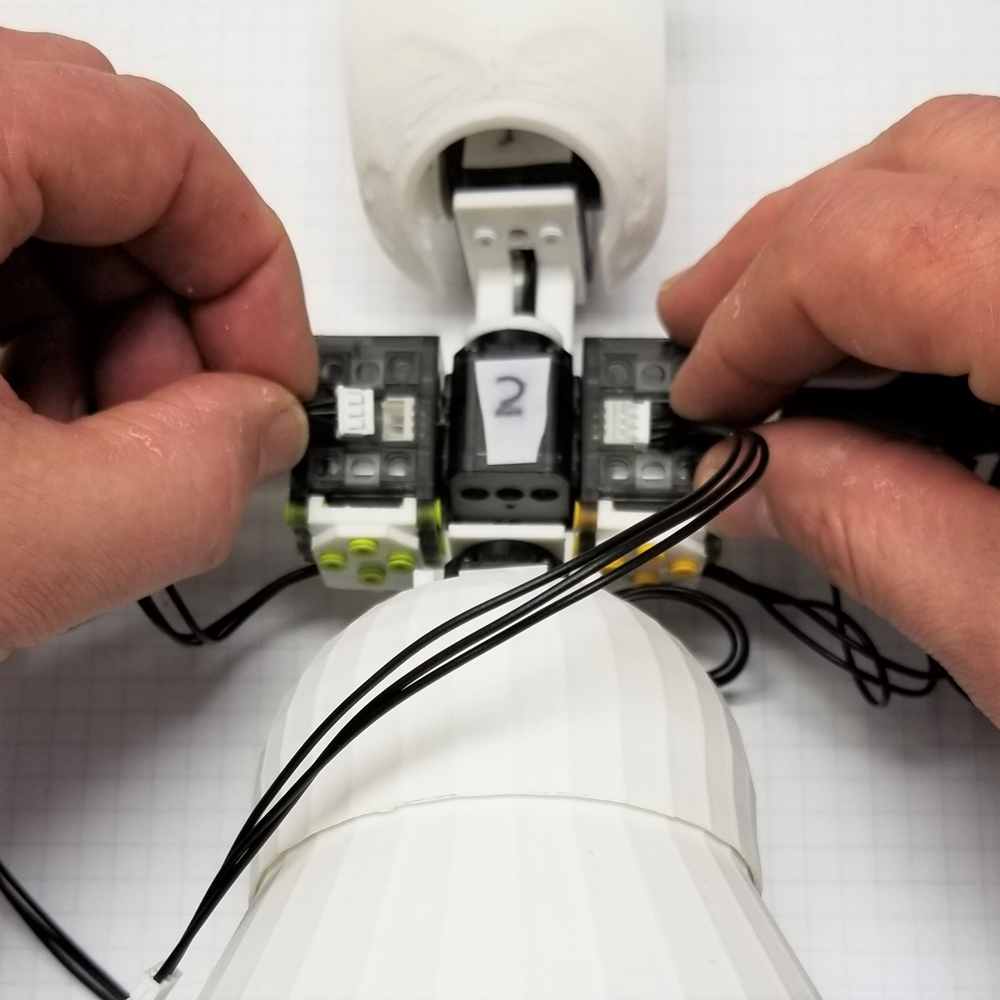

- Route the (2) 190mm cables connected to servos ID:005 and ID:009 along with the 130mm cable connected to servo ID:004 down through the hip cover and the square hole in the top of the base frame.
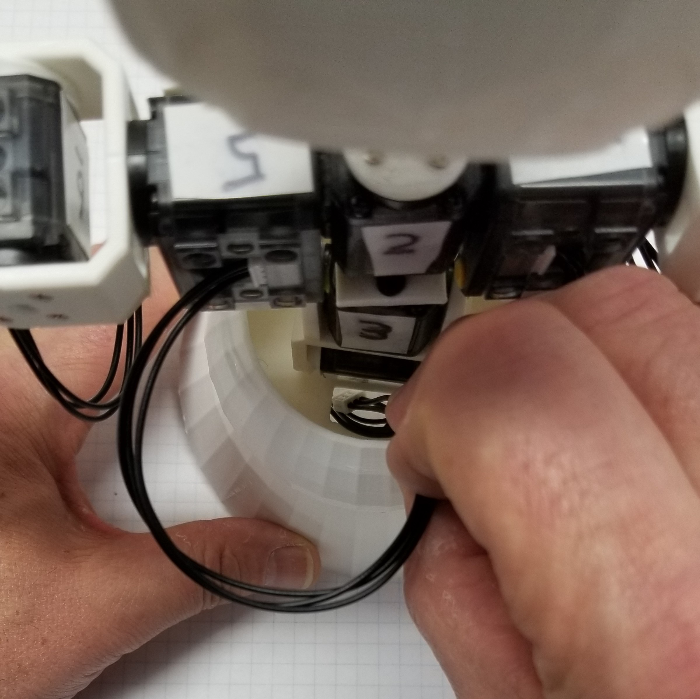

- ***With the USB3 hub power cable unplugged,*** insert the cables connected to servo ID:004, ID:005, and ID:009 into the three open connectors on the servo controller PC board.
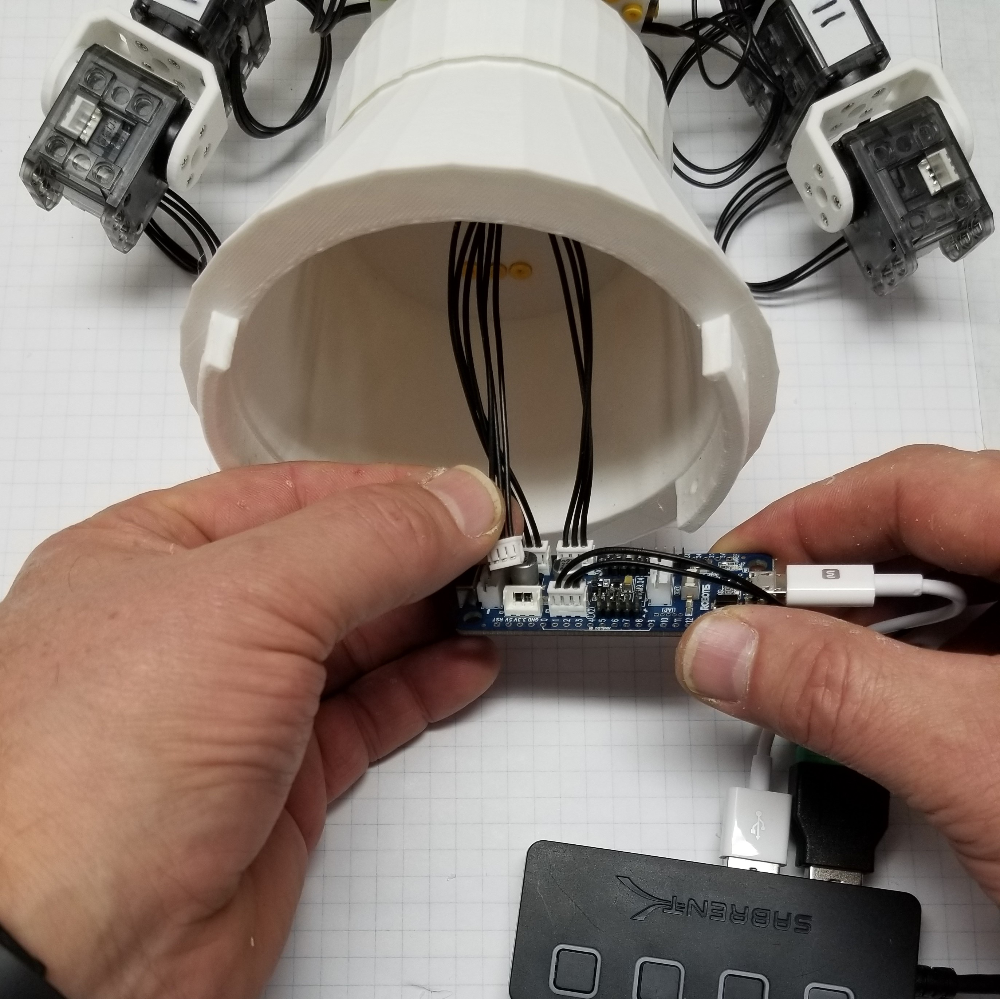

- Place the controller electronics and USB3 hub into the base, with the USB terminal block resting in the right-side slot.
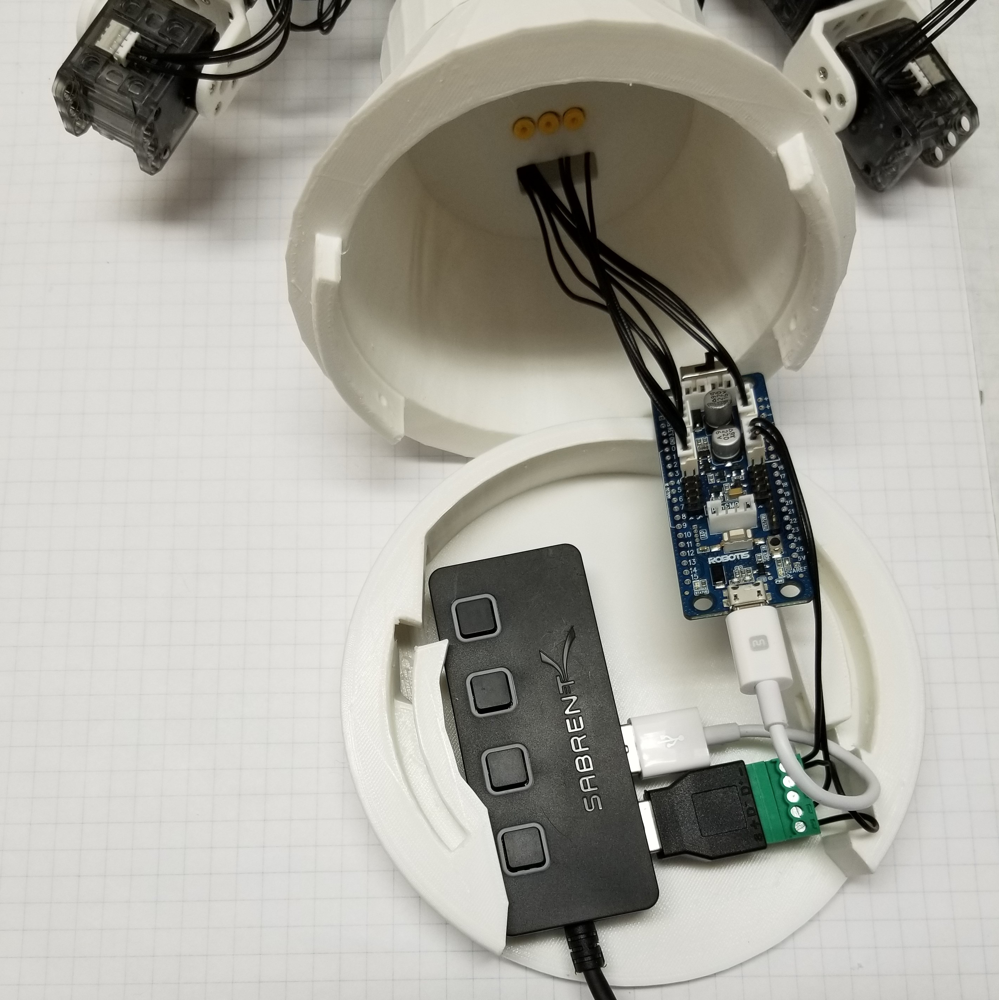

- Insert the large curved tabs on the bottom of the base frame into the slots on the base, with the open end of the base toward the rear.
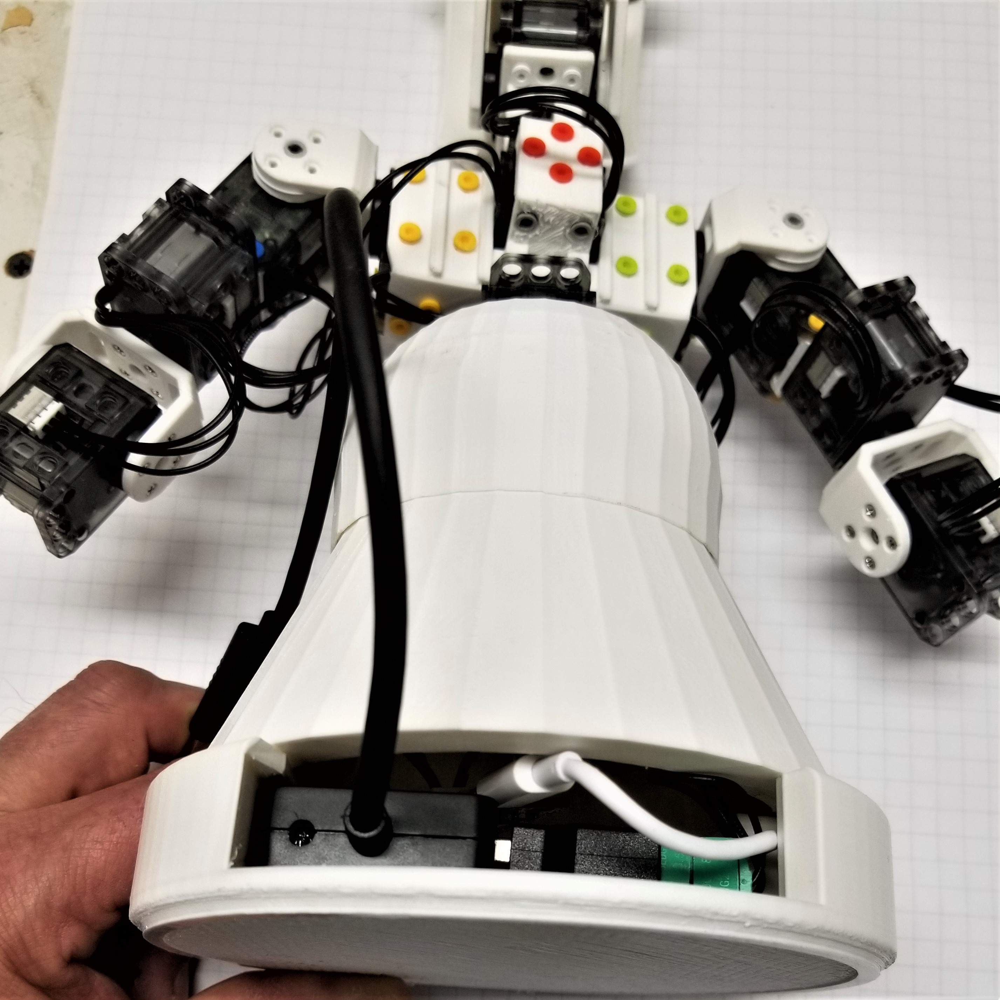

- Plug the power connector into the USB3 Hub and observe all of the servos flash red LED's.
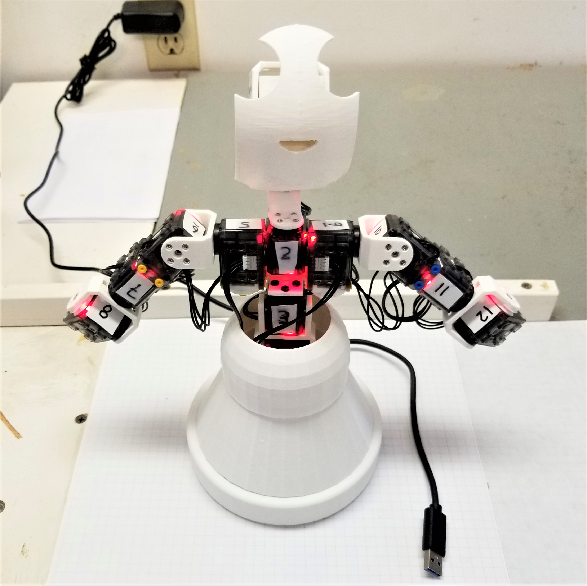

#### **Third, test the servos:**
- With the USB3 hub power cable connected, insert the USB3 cable into the PC.
- On the PC, launch the Dynamixel Wizard 2.0 application.

- Select the **Scan** button on the top-level menu and allow the dialog box to complete its scan and close by itself.
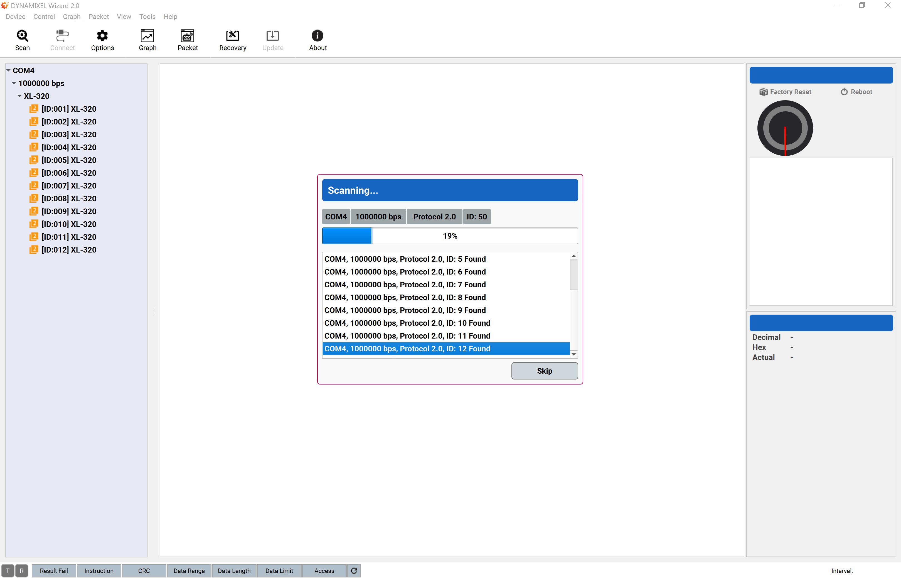

- Observe all twelve of the servo ID's listed in the left-side panel.
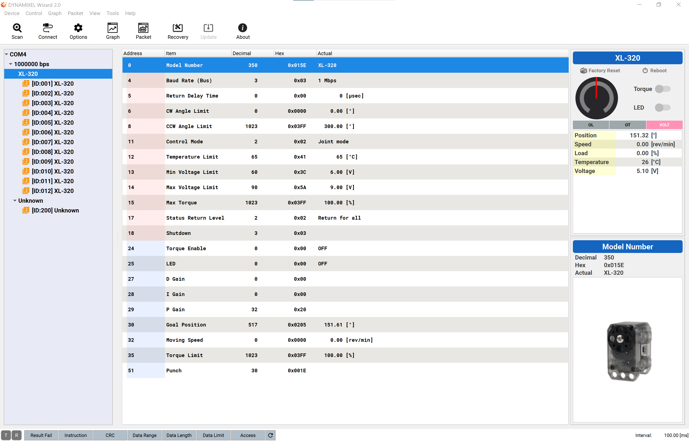

- Test control and movement of each servo by selecting them one-by-one in the left-side list, then using the upper-right-side servo UI to turn torque on, move the servo slightly (approximately plus or minus 5 degrees), and then turn torque back off.

***Tip: Be cautious when manually commanding the servos to move.*** The gestureBot assembly will physically limit the servos' rotation due to body part collisions. If a servo is driven into a collision, it may cause damage to the parts or the servo. As a protective feature, the servos may automatically shutdown in these cases and require a reset by unplugging the USB hub from the computer and then the power cable from the USB hub, waiting 15 seconds, then first plugging the hub power and then the USB connection to the PC back in. Also, ***do not change the servos from 'Joint' to 'Motor' mode.*** If driven in Motor mode the servos will wind their connection cables causing damage or automatic shutdown.

## [**Next-> Session 8:** Complete the Head](Session08.md)
