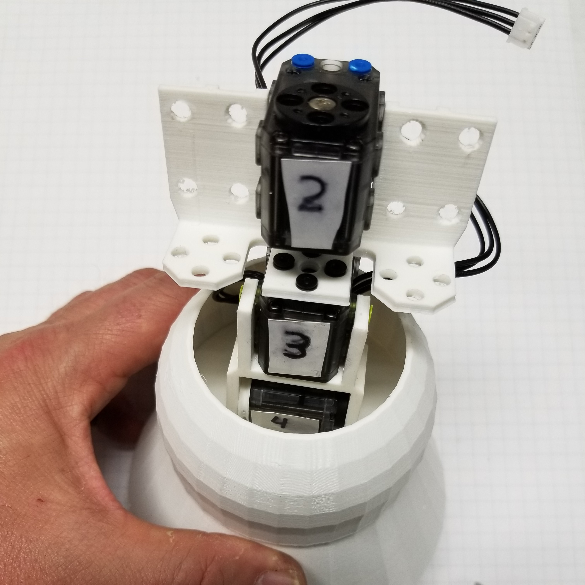

##  [Microsoft Applied Robotics Research Library](https://special-giggle-b26bab5f.pages.github.io/)
### Open Source Samples for Service Robotics
  

# gestureBot Construction Guide

The gestureBot is adapted from the [**Mini**](https://www.robotis.us/robotis-mini-intl/) robot kit from [**Robotis, Inc**](https://www.robotis.us) and the MSRAbot project created by interns at Microsoft Research Asia.
The information on this page will guide you through [**purchasing**](#purchased-parts) and [**printing**](#3d-printed-parts) parts, as well as [**step-by-step assembly**](#step-by-step-instructions) of the gestureBot.

# Before you begin...
If you have experience in 3D printing and electronic assembly, we hope that you find this project relatively simple and straight-forward.  Once the parts are in-hand, the time required to complete the project won't be much more than it takes to print the 3D models.

If you are not experienced in these areas, one of the first things you'll learn is that desktop ***3D-printers are not a good source of instant gratification!***  Even the smallest of the models contained in this kit will take several hours to print, while some of the larger models take more than half a day.  With those time requirements in mind, we broke the procedures down into work sessions that fit along with the 3D print operations. Alternatively, a class of 5-10 students taking on this project might be successful with serial use of a single 3D printer and meeting once-a-week to perform the other assembly tasks.

An important feature of these instructions is their sequence. Following the steps in the sessions ***in order*** is key to preventing the need to disassemble an assembly in order to have access to cable pathways or screw and rivet holes.

# ***Safety Alert:***

We've found that a key to success in building this and other projects using 3D-printed plastic parts is to ***know your own strength***. Human hands can be more than strong enough to damage or destroy plastic parts, especially when muscle force is amplified by the leverage provided by a tool. For example, gripping a screwdriver with your fingers instead of the palm of your hand will limit the torque force you can apply with your muscles when driving a metal screw into a plastic servo horn (wheel). ***When applying muscle force with a tool against a plastic part, being aware of where the stationary force from your hand, body, or workbench is pushing back against your tool can avoid suddenly breaking the part and possibly causing injury.*** It is also helpful to use vision as well as force when tightening a screw. Paying attention to the closing gaps when turning a screw can help avoid stripping threads in the plastic and will make for stronger connections. A famous book that discusses this concept of "mechanic's feel" as well as other challenges in life is [***Zen and the Art of Motorcycle Maintenance: An Inquiry into Values***](https://hpb.com/products/zen-and-the-art-of-motorcycle-maintenance-an-inquiry-into-values-9780060589462) by Robert M. Persig.

## Requirements
Here are the physical things you'll need to build and use your gestureBot:

### PC
- x64 CPU
- Microsoft Windows 10
- USB3 port (USB2 can work in some cases)

### Tools
- 3D printer (we use an [Ultimaker3](https://ultimaker.com/3d-printers/ultimaker-3) with PLA filament)
- [Wire Stripper/Cutter](https://vetco.net/products/16awg-32awg-wire-stripper-cutter/plat-15005c)
- [small Phillips screwdriver (PH0)](https://vetco.net/products/general-tools-712010-precision-screwdriver-phillips-0)
- [small flat-blade screwdriver (2mm)](https://vetco.net/products/)
  - Alternative Screwdrivers:
    - [5 in 1 Precision Screwdriver](https://vetco.net/products/general-tools-spc606-jewelers-screwdriver-set-of-5)
    - [16 in 1 Precision Screwdriver](https://vetco.net/products/16-in-1-precision-screwdriver-set)
- pen and light-colored tape for labeling servo ID's

### Optional but Helpful Tools
- [Rivet Tool](https://www.robotis.us/tool-stl/)
- needle-nose pliers
- [Magnet (for easier screw driving)](https://vetco.net/products/3-4-round-magnet/son-pm550)
- 3mm drill bit, variable speed drill
- [3D-printing cleanup tools](https://www.matterhackers.com/articles/tools-of-the-trade-to-make-your-life-as-a-3d-print-master-much-simpler). A swivel deburring tool is especially useful.

## Parts List
### Purchased Parts
|**ID**|**Qty**|**Name & Purchase Link**|** . **|
|:--:|:--:|:----------:|:------:|
|P1|12|[Robotis XL-320 Servo Motors (includes short connection cable)](https://www.robotis.us/dynamixel-xl-320/)||
|P2|1|[USB3 Hub with Power Supply](https://vetco.net/products/4-port-powered-usb-3-0-hub/vupn615)||
|P3|1|[Robotis OpenCM9.04c Servo Control Circuit Board](https://www.robotis.us/opencm9-04-c-with-onboard-xl-type-connectors/)|
|P4|1|[USB Terminal Block](https://vetco.net/products/usb-a-male-to-screw-terminal-breakout/cv051)|
|P5|1|[Short USB Cable (USB-A to USB-Micro)](https://vetco.net/products/usb-a-to-micro-usb-90-angle/)||
|P6|2|[Long (19cm) Servo Connection Cables](https://www.robotis.us/robot-cable-3p-xl-190mm-5pcs/)||
|P7|1|[6mm Plastic Rivets, (40) short (2-step) and (10) long (3-step)](https://www.robotis.us/robotis-mini-rivet-set/)||
|P7 (alternate)|1|[6mm Plastic Rivets (weaker but lower-cost, variety of colors)](https://www.robotis.us/rivet-set-rs-10/)||
|P8|1|[Screw Set](https://www.robotis.us/robotis-mini-screw-set/)|

### 3D Printed Parts
|**ID**|**Qty**|**Name & Model Link**|** . **|
|:--:|:--:|:--:|:------:|
|M1|1|[&nbsp; &nbsp; &nbsp; &nbsp; &nbsp; &nbsp; &nbsp; &nbsp; &nbsp; &nbsp; &nbsp; &nbsp; &nbsp; &nbsp; Base &nbsp; &nbsp; &nbsp;&nbsp; &nbsp;&nbsp; &nbsp;&nbsp; &nbsp;&nbsp; &nbsp; &nbsp; &nbsp; &nbsp; &nbsp; &nbsp; ](https://github.com/microsoft/gestureBotDesignKit/blob/main/hardware/3D_Print/gB_Base.stl)||
|M2|1|[Base Frame](https://github.com/microsoft/gestureBotDesignKit/blob/main/hardware/3D_Print/gB_BaseFrame.stl)||
|M3|1|[Bracket Cover (Rivet Side)](https://github.com/microsoft/gestureBotDesignKit/blob/main/hardware/3D_Print/gB_BracketCover_RivetSide.stl)||
|M4|1|[Bracket Cover (Screw Side)](https://github.com/microsoft/gestureBotDesignKit/blob/main/hardware/3D_Print/gB_BracketCover_ScrewSide.stl)||
|M5|2|[Ear](https://github.com/microsoft/gestureBotDesignKit/blob/main/hardware/3D_Print/gB_Ear.STL)||
|M6|1|[Eyes](https://github.com/microsoft/gestureBotDesignKit/blob/main/hardware/3D_Print/gB_Eyes.STL)||
|M7|1|[Face](https://github.com/microsoft/gestureBotDesignKit/blob/main/hardware/3D_Print/gB_Face.STL)||
|M8|2|[Hand](https://github.com/microsoft/gestureBotDesignKit/blob/main/hardware/3D_Print/gB_Neck.stl)||
|M9|1|[Head Frame](https://github.com/microsoft/gestureBotDesignKit/blob/main/hardware/3D_Print/gB_HeadFrame.stl)||
|M10|1|[Hip Cover](https://github.com/microsoft/gestureBotDesignKit/blob/main/hardware/3D_Print/gB_HipCover.stl)||
|M11|1|[Hood](https://github.com/microsoft/gestureBotDesignKit/blob/main/hardware/3D_Print/gB_Hood.stl)||
|M12|1|[Neck](https://github.com/microsoft/gestureBotDesignKit/blob/main/hardware/3D_Print/gB_Neck.stl)||
|M13|1|[Servo Cover](https://github.com/microsoft/gestureBotDesignKit/blob/main/hardware/3D_Print/gB_ServoCover.stl)||
|M14|2|[Servo Mount Plate](https://github.com/microsoft/gestureBotDesignKit/blob/main/hardware/3D_Print/gB_ServoMountPlate.stl)||
|M15|2|[Servo Side Cover](https://github.com/microsoft/gestureBotDesignKit/blob/main/hardware/3D_Print/gB_ServoSideCover.stl)||
|M16|2|[Servo Wheel](https://github.com/microsoft/gestureBotDesignKit/blob/main/hardware/3D_Print/gB_ServoWheel.stl)||
|M17|2|[Speaker](https://github.com/microsoft/gestureBotDesignKit/blob/main/hardware/3D_Print/gB_Speaker.stl)||
|M18|2|[Head Swing Bracket](https://github.com/microsoft/gestureBotDesignKit/blob/main/hardware/3D_Print/gB_SwingBracket_Head.stl)||
|M19|2|[Hip Swing Bracket](https://github.com/microsoft/gestureBotDesignKit/blob/main/hardware/3D_Print/gB_SwingBracket_Hip.stl)||
|M20|1|[Screw-Mount Swing Bracket](https://github.com/microsoft/gestureBotDesignKit/blob/main/hardware/3D_Print/gB_SwingBracket_ScrewMount.stl)||
|M21|1|[Upper Torso Back Cover](https://github.com/microsoft/gestureBotDesignKit/blob/main/hardware/3D_Print/gB_UpperTorsoBackCover.stl)||
|M22|1|[Upper Torso Front Cover](https://github.com/microsoft/gestureBotDesignKit/blob/main/hardware/3D_Print/gB_UpperTorsoFrontCover.stl)||
|M23|1|[Upper Torso Frame](https://github.com/microsoft/gestureBotDesignKit/blob/main/hardware/3D_Print/gB_UpperTorsoFrame.stl)||

# Step-by-Step Instructions
The 3D-printed parts are used to organize this project's task steps into sessions. 3D printing a part usually requires more time than is reasonable for a work session, often leaving the print operation to complete overnight as the most practical solution.

## Session 1: [Set Up the Servo Controller Electronics](./Session01.md)
In the first session we will begin the process of 3D-printing the gestureBot's plastic parts starting with the base frame while connecting the servo controller to the powered USB3 Hub and a single servo motor.

## Session 2: [Configure the Servos](./Session02.md)
In the second session we will 3D-print the gestureBot's torso components while establishing the communication network for our servo motors by connecting them one-by-one to the PC and using using the [Robotis Dynamixel Wizard 2.0](http://en.robotis.com/service/downloadpage.php?ca_id=10) application to program each with a unique ID.

## Session 3: [Assemble the Torso](./Session03.md)
In the third session we will 3D-print the head components while assembling the gestureBot's torso.

## Session 4: [Assemble the Head Structure](./Session04.md)
In the fourth session we will 3D-print the components for both arms while assembling the structural components of the gestureBot's head.

## Session 5: [Assemble the Right Arm](./Session05.md)
In the fifth session we will 3D-print the base component while assembling the gestureBot's right arm.

## Session 6: [Assemble the Left Arm](./Session06.md)
In the sixth session we will 3D-print the eye and ear components (in an alternate color if desired) while assembling the gestureBot's left arm.

## Session 7: [Attach the Arms and Test the Servos](./Session07.md)
In the seventh session we will 3D-print the hood component (in an alternate color if desired) while we attach the arms to the torso and test the servos using the [Robotis Dynamixel Wizard 2.0](https://www.robotis.us/dynamixel-management/) application.

## Session 8: [Complete the Head](./Session08.md)
In the eigth session we will 3D-print the hands and arm servo covers while we assemble the the head components.

## Session 9: [Install the Body Covers](./Session09.md)
In the ninth session we will 3D-print the torso front and back covers while we install the arm servo covers and hands.

## Session 10: [Run the Gesture Applications](./Session10.md)
In the tenth session we will 3D-print the torso cover components while we attach the hands and the arm servo covers. At this point the gestureBot will be ready to run the Labanotation Suite software applications. The torso covers can be attached as soon as they are finished printing.

# A last word...
Something to keep in mind is that this kit is designed to be changed and adapted. The 3D models are simple and lend themselves to modifications using such tools as [**Blender**](https://www.blender.org/). Additional devices such as cameras, microphones, and loudspeakers can be added using the two available USB ports in the base of the robot, as well as leveraging other devices and connections through the host PC. 

We can't wait to see what you come up with!

***--the Microsoft Applied Robotics Research Team***

