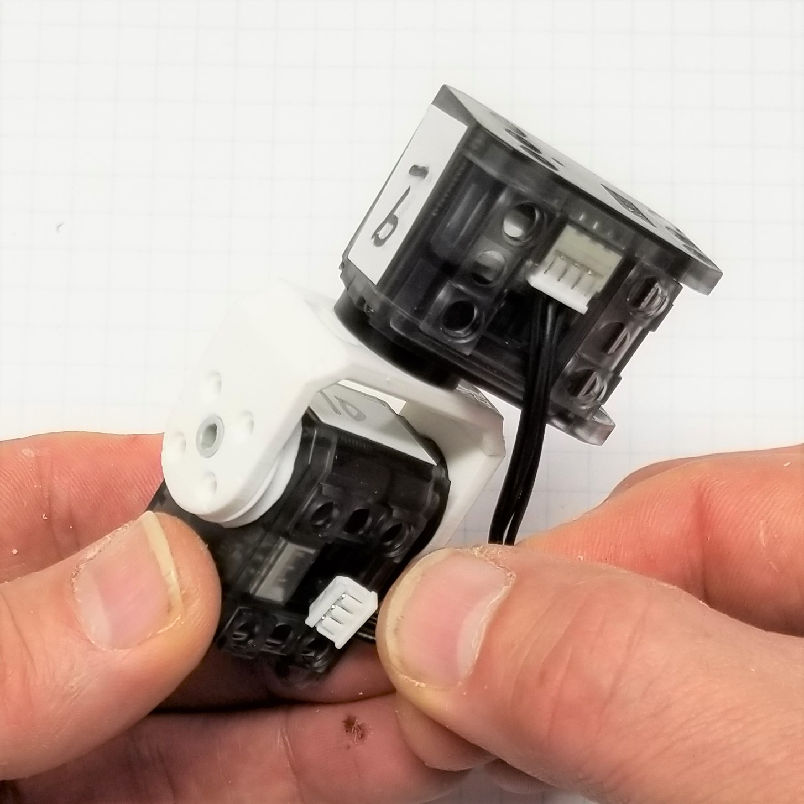
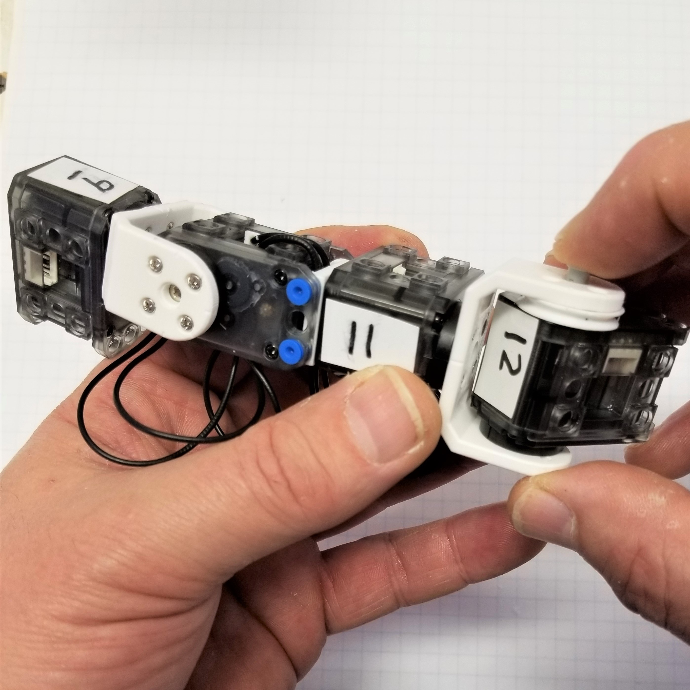

##  [Microsoft Applied Robotics Research Library](https://special-giggle-b26bab5f.pages.github.io/)
### Open Source Samples for Service Robotics
  
# [gestureBot Construction Guide](../hardware/README.md)

## **Session 6:** Assemble the Left Arm
In this session we will 3D-print the eye and ear components (in an alternate color if desired) while assembling the gestureBot's left arm.

### Parts: 
- servos labeled ID:009, ID:010, ID:011, and ID:012 programmed in Session 2
- (3) 130MM servo cable
- (16) short plastic rivets
- (2) long plastic rivets
- (16) 3mm miniature steel screws
- [(2) Screw Mount Swing Bracket](https://github.com/microsoft/gestureBotDesignKit/blob/main/hardware/3D_print/gb_SwingBracket.stl) 3D-printed in Session 4, the swing brackets and servo wheels form a shoulder joint between servos ID:009 and ID:010 and an elbow joint between servos ID:011 and ID:012.
- [(2) Servo Wheel](https://github.com/microsoft/gestureBotDesignKit/blob/main/hardware/3D_print/gb_ServoWheel.stl) 3D-printed in Session 4, the servo wheels support the swing bracket mounts for servo ID:010 and ID:012.
- [(2) Servo Mount Plate](https://github.com/microsoft/gestureBotDesignKit/blob/main/hardware/3D_print/gb_ServoMountPlate.stl) 3D-printed in Session 4, the servo mount plates support the servo ID:009 attachment to the upper torso frame and form a lower arm section between servo ID:010 and ID:011.

### Tools: 
- PH0 Phillips screwdriver
- plastic rivet tool

### **Procedure:**

#### **First, start 3D-printing the parts required for future sessions:**
- [Eyes (use alternative color plastic if desired)](https://github.com/microsoft/gestureBotDesignKit/blob/main/hardware/3D_print/gb_Eyes.stl)
- [(2) Ear (use alternative color plastic if desired)](https://github.com/microsoft/gestureBotDesignKit/blob/main/hardware/3D_print/gb_Ear.stl)

#### **Second, assemble the left arm:**
- Mount a swing bracket to servo ID:009 with (4) 3mm miniature screws, taking care to align the tick-marks on the servo horn, the servo cover, and the swing bracket.

- Attach servo wheel to left shoulder swing bracket by inserting a long rivet through the bracket and into the back of servo ID:010. Do not install the rivet pin to allow the servo wheel to rotate freely.

- Mount the servo ID:010 horn to the left shoulder swing bracket with (4) 3mm miniature screws and taking care to align servo horn ***double tick-marks*** with the tick-mark on the bracket. Note that in this case the alignment is made with the opposite side of the servo horn.

- With (3) short rivets, attach a servo mount plate to the back of servo ID:011 with the mount hole rings oriented length-wise to the servo.

- Connect a 130mm cable to the top-side connector of servo ID:010. 

- Attach servo ID:010 to ID:011 using (4) short rivets in the mount plate while routing the cable connected to servo ID:010 through the space between the servo and the mount plate.

- Connect cable from servo ID:010 to servo ID:011 on its bottom-side connector.

- Mount the left elbow swing bracket to servo ID:011 with (4) 3mm miniature screws taking care to align the tick-mark on the servo horn with the tick-mark on the servo cover and the bracket.

- Attach servo wheel to left elbow swing bracket by inserting a long rivet through the bracket and into the back of servo ID:012. Do not install the rivet pin to allow the servo wheel to rotate freely.

- Mount the servo ID:012 horn to the left elbow swing bracket with (4) 3mm miniature screws and taking care to align servo horn ***double tick-marks*** with the tick-mark on the bracket. Note that in this case the alignment is made with the opposite side of the servo horn.

- Connect a 130mm cable from the top connector of servo ID:011 to the rear-side connector of servo ID:012.

- Connect a 130mm cable from the rear-side connector of servo ID:009 to the bottom-side connector of servo ID:010.

## [**Next-> Session 7:** Attach the Arms and Test the Servos](Session07.md)
