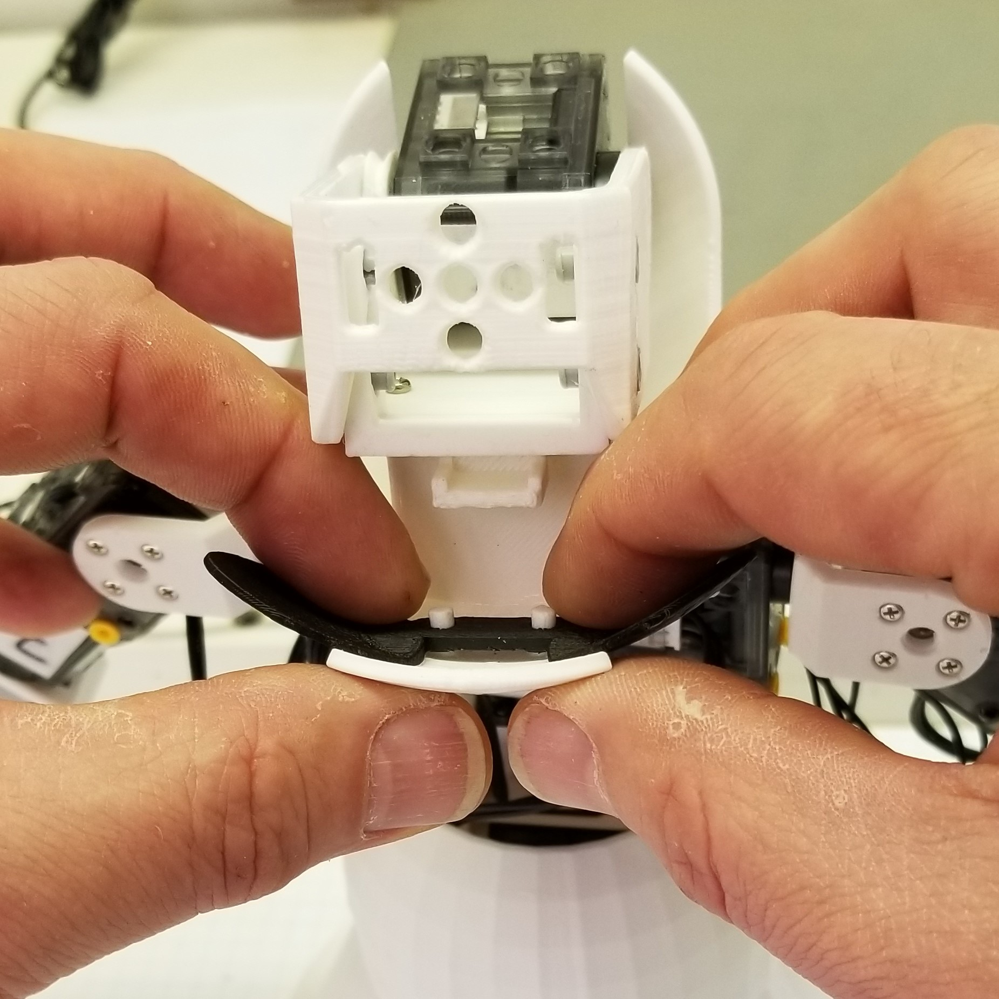

##  [Microsoft Applied Robotics Research Library](https://special-giggle-b26bab5f.pages.github.io/)
### Open Source Samples for Service Robotics
  
# [gestureBot Construction Guide](../hardware/README.md)

## **Session 8:** Complete the Head
In this session we will 3D-print the hands and arm servo covers while we assemble the the head components.

### Parts: 
- gestureBot (partially assembled through Session 7)
- (4) short plastic rivets
- [Hood](https://github.com/microsoft/gestureBotDesignKit/blob/main/hardware/3D_print/gb_Hood.stl) 3D-printed in Session 7, the hood provides a cosmetic cover for the head structure assembly.
- [Eyes](https://github.com/microsoft/gestureBotDesignKit/blob/main/hardware/3D_print/gb_Eyes.stl) 3D-printed in Session 6, the eyes provide a cosmetic cover addition to the face component.
- [Ear](https://github.com/microsoft/gestureBotDesignKit/blob/main/hardware/3D_print/gb_Ear.stl) 3D-printed in Session 6, the ears provide cosmetic covers and removable access to the interior of the head assembly without requiring the hood to be removed.

### Tools: 
- PH0 Phillips screwdriver
- needle nose pliers

### **Procedure:**

#### **First, start 3D-printing the parts required for future sessions:**
- [(6) Servo Cover](https://github.com/microsoft/gestureBotDesignKit/blob/main/hardware/3D_print/gb_ServoCover.stl)
- [(12) Servo Side Cover](https://github.com/microsoft/gestureBotDesignKit/blob/main/hardware/3D_print/gb_ServoSideCover.stl)
- [(2) Hand](https://github.com/microsoft/gestureBotDesignKit/blob/main/hardware/3D_print/gb_Hand.stl)

#### **Second, attach the eyes, hood, and ears:**
- Mount the eyes component by inserting the two posts behind the face into the two holes in the bridge between the eyes.

***Tip:*** To avoid breaking the face component, be careful to support the face as you push the eyes onto the posts.

- Mount the hood by tilting the head assembly forward, sliding the hood onto the head swing bracket and attaching the hood to the bracket with (4) rivets.

***Tip:*** Using a pair of needle-nose pliers may be helpful in inserting the rivets.

- Attach the ears buy snapping each into the holes on the sides of the hood.

- Inspect the complete head assembly.

## [**Next-> Session 9:** Install the Body Covers](Session09.md)
