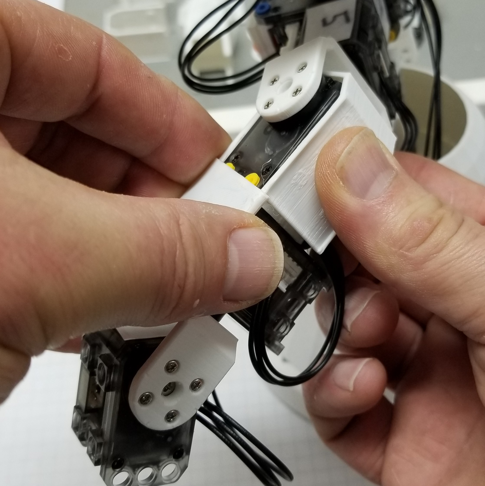

##  [Microsoft Applied Robotics Research Library](https://special-giggle-b26bab5f.pages.github.io/)
### Open Source Samples for Service Robotics
  
# [gestureBot Construction Guide](../hardware/README.md)

## **Session 9:** Install the Body Covers
In this session we will 3D-print the torso cover components while we attach the hands and the arm servo covers. All of the cover components are designed to be removable without disassembling the gestureBot. At this point the gestureBot is ready to run the Labanotation Suite software applications. The torso covers can be attached as soon as they are finished printing.

### Parts: 
- [(6) Servo Covers](https://github.com/microsoft/gestureBotDesignKit/blob/main/hardware/3D_print/gb_ServoCover.stl)
- [(8) Servo Side Covers](https://github.com/microsoft/gestureBotDesignKit/blob/main/hardware/3D_print/gb_ServoSideCover.stl)
- [(4) Screw-side Swing Bracket Covers](https://github.com/microsoft/gestureBotDesignKit/blob/main/hardware/3D_print/gB_BracketCover_ScrewSide.stl)
- [(4) Rivet-side Swing Bracket Covers](https://github.com/microsoft/gestureBotDesignKit/blob/main/hardware/3D_print/gB_BracketCover_RivetSide.stl)
- [(2) Hand](https://github.com/microsoft/gestureBotDesignKit/blob/main/hardware/3D_print/gb_Hand.stl)
- [Upper Torso Front Cover](https://github.com/microsoft/gestureBotDesignKit/blob/main/hardware/3D_print/gb_UpperTorsoFrontCover.stl)
- [Upper Torse Back Cover](https://github.com/microsoft/gestureBotDesignKit/blob/main/hardware/3D_print/gB_UpperTorsoBackCover.stl)

### **Procedure:**

#### **First, start 3D-printing the parts required for future sessions:**
- [Upper Torso Front Cover](https://github.com/microsoft/gestureBotDesignKit/blob/main/hardware/3D_print/gb_UpperTorsoFrontCover.stl)
- [Upper Torse Back Cover](https://github.com/microsoft/gestureBotDesignKit/blob/main/hardware/3D_print/gB_UpperTorsoBackCover.stl)

#### **Second, install the right arm covers and hands:**
- Route the cable connecting servo ID:006 to ID:005 folding downward and between the side servo mounting holes, then slide the cover over the servo.
 

- Install the servo ID:006 top-side cover by sliding it over the servo cover's ridges.
 

- Install the servo ID:006 bottom-side cover by sliding it over the servo cover's ridges and routing the connection cable between the side cover and the servo wheel.
 
***Tip:*** The bottom side cover may need to be slightly cut down if it interferes with the swing bracket.

- Route the cable connecting servo ID:006 and ID:007 folding downward and between the bottom servo mounting holes, then slide the cover over the servo.
 

- Install the servo ID:007 top-side cover by sliding or snapping it over the servo cover's ridges.
 

- Install the servo ID:007 bottom-side cover by sliding or snapping it over the servo cover's ridges and routing the cable connecting servo ID:007 to ID:008 through the gap between the servo mounting holes.
 

- Route the cable connecting servo ID:007 to ID:008 folding to downward across the connector and between the side servo mounting holes, then slide the cover over the servo.
 

- Install the servo ID:008 hand by sliding over the servo cover's side ridges.
 

- Install the servo ID:006 rivet-side swing bracket cover by inserting its post into the long rivet hole.
 

- Install the servo ID:008 rivet-side swing bracket cover by inserting its post into the long rivet hole.
 

- Install the servo ID:006 screw-side swing bracket cover by inserting its post into the bracket hole.
 

- Install the servo ID:008 rivet-side swing bracket cover by inserting its post into the bracket hole.
 

#### **Third, repeat the procedure above installing the servo covers and hands for the left arm:**

#### **Fourth, install the upper torso covers:**
- Slide the upper torso cover over the gestureBot from front to back and taking care to route the cable connecting the shoulder and upper arm servos through the slot on the side of the cover.

- Install the upper torso back cover by hooking it over the side ridges on the front cover, taking care to place the offset tab on the cover's "wings" on the inside of the front cover, and then snapping it into place.

- Inspect the completed gestureBot covers.

## [**Next-> Session 10:** Run the Gesture Applications](Session10.md)
