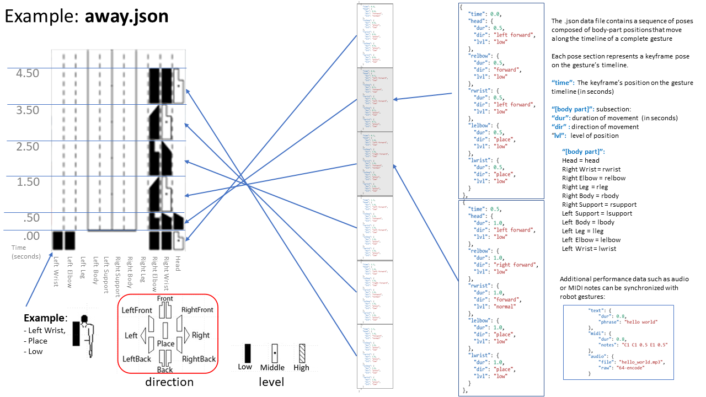
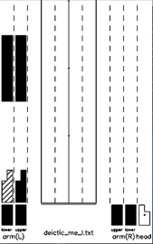
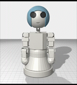

# [Microsoft Applied Robotics Research Library](https://github.com/microsoft/AppliedRoboticsResearchLibrary)
  

# Labanotation Suite: [gestureBot Design Kit](/README.md)

# **Gesture Library**
This folder **/src/Labanotation/gestureLibrary/** contains sample gesture data expressed as Labanotation scores in the .json file format. Valid gesture files in child folders will be picked up by the Labanotation Controller service when it launches and made available to client applications.

 A complete listing of the database including a video clip of each gesture is provided at the end of this page.

## Classification and Clustering of Gesture-concept Pairs

This Gesture Library is organized around 40 clusters of gesture-concept pairs retrievable by a Gesture Engine component. 

- 6 deictic concepts (me, you, this, that, here, there)
- 33 expressive theme concepts (hello, many, question, etc.)
- 1 "beat" concept used for idling

The clusters were segregated using a method described in the paper: [***Development and Verification of a Gesture-generating Architecture for Conversational Humanoid Robots:*** ](https://hal.archives-ouvertes.fr/hal-03108169) 

- First, the most import word in each of a data-set of 230 English conversational sentences was identified using vector analysis in a low-dimensional space.  
- Next, each of these identified words were manually paired with a corresponding gesture encoded in Labanotation. 
- Finally, performance of the 230 gestures was compared using the geodesic distance between elements of movement across the set of gestures to identify the most similar movement sequences and consolidate the groups into a final set of 40 clusters.

In each of the expressive theme clusters, synonyms of the concept label are included in the record. Also, there may be found data files containing variations of the gesture associated with the same concept. These features can allow a Gesture Engine to select alternatives in order to avoid un-natural repetitions of exactly the same gesture.

The decisions required to define a gesture database in terms of how many and what types of concepts will be included will also be factors in the qualative performance (life-like realism) of gestures performed by robots. At this time, quantitative analysis resulting in concept groupings or clusters has not delivered a higher quality of lifelike gestures over clusters curated subjectively by human mind and hand.

Additionally, interchangeable data volumes must be considered for a Gesture Library that contain gesture sets that at-worst stereotype ethnic or gender character traits and at-best can mimic comfortably familiar or iconic celebrity personalities.

In any case, the current state of the art does not provide a reasonable method to define a gesture library. More exploration and discovery is needed before robots can, without procedural programming, effectively select and synchronize gestures with rendered speech to a degree that supports and enhances human-robot-interaction. We hope that this gestureBot Design Kit will be useful and support further research and development in  human-robot-interaction.

Links to related work in this field:

- https://arxiv.org/abs/1905.08702 Design of conversational humanoid robot based on hardware independent gesture generation
- https://hal.archives-ouvertes.fr/hal-03047565/document SRG3: Speech-driven Robot Gesture Generation with GAN 
- https://www.osaka-kyoiku.ac.jp/~challeng/SIG-Challenge-057/SIG-Challenge-057-15.pdf Improving Conditional-GAN using Unrolled-GAN for the
Generation of Co-speech Upper Body Gesture

- https://arxiv.org/abs/2010.06194 Manual Clustering:  Labeling the Phrase Set of the Conversation Agent, Rinna

## Gesture Labanotation in .json Format
An example of the data structure in the .json files is provided in [GestureFormat.json](/src/Labanotation/GestureFormat.json).

A Labanotation score contains vertical columns representing specific body parts with notations indicating global positions of those parts in transition over a time-line flowing from bottom to top. In our .json files, from the Labanotation score we group horizontal sets of body-part movements into poses comprising keyframes that correspond to sections within the file.

## Table of Concept-Gesture Pairs in Library:

### **Deictic**

|concept name|similar words|gesture file|Labanotation Score|Video|
|-------|----------------------------|---------|-------------|---------------|
|=======|============================|==========|=============|===============|
|me|{::nomarkdown}<ul><li>I, my, me</li></ul>{:/}|deictic me I.json|||
|you|you, your|deictic you d.json|||
|this|this|deictic this.json|||
|that|that|deictic that.json|||
|here|here|deictic here.json|||
|there|there|deictic there.json|||

### **Expressive Themes**

|concept name|similar words|gesture file|Labanotation Score|Video|
|-------|----------------------------|---------|-------------|---------------|
|=======|============================|=========|=============|===============|
|away|away, hurry up, go out|away.json|||
|bad|bad, busy, boring, unusual|bad.json|||
|come|come, it's time, help, withdraw|come.json|||
|confuse|confuse, never heard, puzzle|confuse.json|||
|contrast|contrast, upside down, inside out, change|contrast.json|||
|disgust|hate, don't like, dislike, too much|dont_like4.json|||
|drink|drink, coffee, hangover, beer|drink.json|||
|go|go, walk, work out, jog, deposit|go.json|||
|good|good, sweet, money, free, fine, date, great|good.json|||
|big|big, large, huge|big.json|||
|goodbye|goodbye, bye, leaving, good night, see you|goodbye.json|||
|happy|happy, glad, wake, good, moved, encore, cheers, best|happy.json|||
|hello|hello, hi, welcome, good morning|hello.json|||
|hungry|hungry, eat, dinner|hungry.json|||
|interesting|interesting|interesting.json|||
|laugh|laugh, sing|laugh.json|||
|lets go|let's go, have to, it's time, hurry, hard, why don't we, go first|letsgo.json|||
|many|many, more, crowded|many.json|||
|nice|nice, good, well|nice.json|||
|nod|nod, yes, come, I will, whenever, strong, OK, ready|nod.json|||
|surprise|surprise, mess, waste|surprise.json|||
|panic|panic, passout, ouch|panic.json|||
|please|please, go ahead, would you, could you, will you, take care, clean up, I'd like|please.json|||
|question|May I, did you, do you, what, where, when, who, why, how|question.json|||
|quit|quit, knife, stop, off|quit.json|||
|say|say, said, talk, request|say.json|||
|shakehead|no, so, cannot, back, drunk, cannot keep, tone-deaf, not taking, pale, do not feel well, sick, itchy|shake_head.json|||
|sleepy|sleepy, sleep, asleep, yawn|sleepy.json|||
|small|small, out of dish|small.json|||
|sorry|sorry, check|sorry.json|||
|thanks|thank, thanks|thanks.json|||
|tired|tired, hangover, lie down, drunk, tipsy, loaded, not feeling well|tired.json|||
|weather|weather, sunny, cloudy, windy, rainy, nice day|weather.json|||

### **Beat (Idle) Movements**
| name|variations|gesture file|Labanotation Score|Video|
|-------|----------------------------|---------|-------------|---------------|
|=======|============================|==========|=============|===============|
|beat|beat, beat_rotate, beat_2, beat_3|beat.json|||

## [/src/Labanotation/kinectSuite](/src/Labanotation/kinectSuite/)
This folder contains gesture data files expressed as Labanotation scores in the JSON file format. These files were captured using a Kinect sensor and human subjects with the Gesture Authoring Tools included in the [Labanotation Suite](https://github.com/microsoft/LabanotationSuite) repository.
