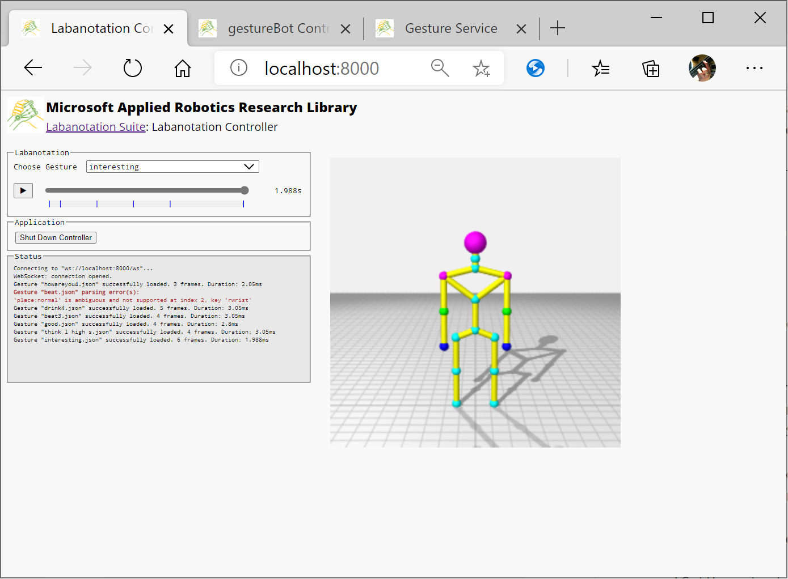
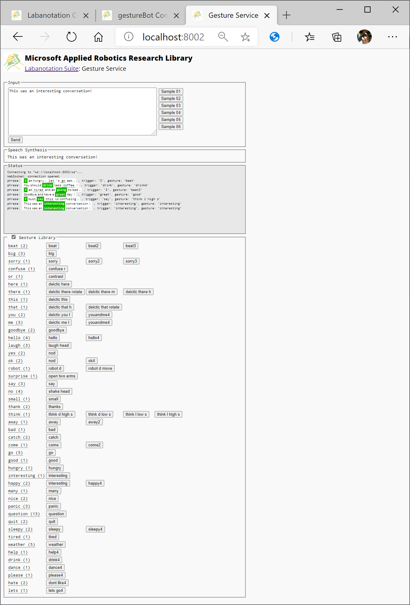
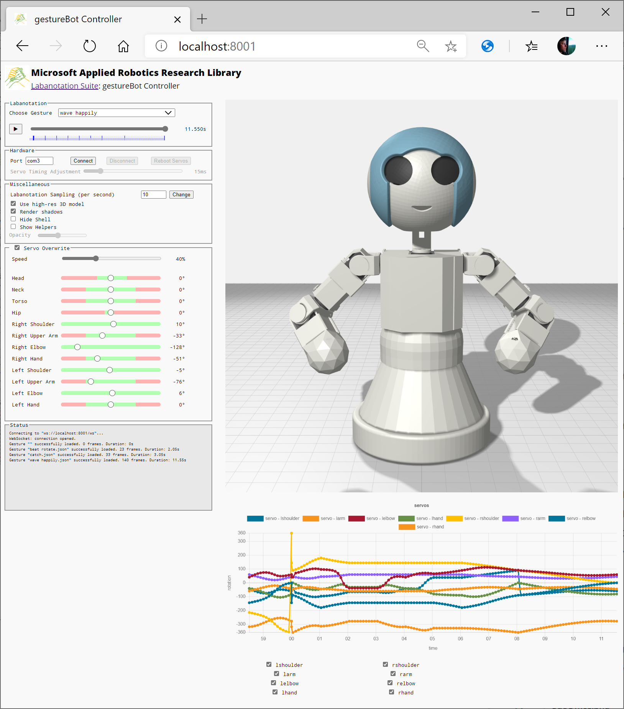

##  [Microsoft Applied Robotics Research Library](https://microsoft.github.io/AppliedRoboticsResearchLibrary/)
### Open Source Samples for Service Robotics
[](https://opensource.org/licenses/MIT)  

# Gesture Service System Sample

The Gesture Service sample source code in 'gestureService_w2v.pyproj' demonstrates how to instantiate and run all of the software modules in the project together:
- Gesture Service
  - Labanotation controller
  - Gesture Engine based on Google word2vec
  - Gesture Library
- gestureBot controller

## Software Installation
The sample 'gestureService_w2v' source code depends on a number of open-source Python libraries. This section provides instructions for installing and operating the software.

### Tested System Software
We used the following software versions to test the Gesture Service samples:
- Windows 10 (Version 2004, 64-bit) **or** Linux (Ubuntu18.04, 64-bit)
- Microsoft Edge Browser (Version 87.0.664.66, 64-bit)
- Git client [*(Comes with Microsoft Visual Studio Code)*](https://code.visualstudio.com/Download)
- [Python 3.7.8](https://www.python.org/downloads/release/python-378/)

### Python Modules
- The following modules are listed in a requirements.txt file for easy installation:
```
numpy==1.19.3
scipy==1.5.2
tornado==4.5.2
opencv-python==4.4.0.46
pyserial==3.4
msgpack-rpc-python==0.4.1
gensim==3.8.3
nltk==3.5
dynamixel_sdk==3.7.31
```

### Installation Instructions
For Windows or Linux, the following instructions will guide you through the installation of code and assets comprising the gestureBot Design Kit as well as dependent external software.

If not already on your PC, download and run the following installers:
- Python 3.7.8:
 [https://www.python.org/downloads/release/python-378/](https://www.python.org/downloads/release/python-378/)

- PIP:
[https://bootstrap.pypa.io/get-pip.py](https://bootstrap.pypa.io/get-pip.py)

From a [**cmd.exe**](C:\WINDOWS\system32\cmd.exe), bash, or other terminal shell:
- Create a folder for the installation in any convenient location and make it the current directory:
```
> mkdir [folder path]
> cd [folder path]]
```
- Clone the repository:
```
> git clone --recursive https://github.com/microsoft/gestureBotDesignKit
```
- Run these commands to download and install required python software modules:

***Tip:*** on some systems, earlier versions of python (such as python 2.7) may already be installed with a need to keep them as they are. In this case, it may be required to set a system variable that creates a path to the new installation with a link such as "python37".

```
> python get-pip.py
> python -m pip install -r requirements.txt
```

The following examples assume the repository was downloaded to a folder:
``` 
c:\Users\robotics\github_repos\gestureBotDesignKit\
```
To provide a sample Gesture Engine implementation, Google's neural network [word2vec](https://code.google.com/archive/p/word2vec/#!) is used and available at this link: https://code.google.com/archive/p/word2vec/#!

  To install, download the [GoogleNews-vectors-negative300.bin](https://drive.google.com/file/d/0B7XkCwpI5KDYNlNUTTlSS21pQmM/edit?usp=sharing) binary file and unzip it into the example Library folder as follows:
```
C:\Users\robotics\github_repos\gestureBotDesignKit\src\Libraries\gestureService_w2v\GoogleNews-vectors-negative300.bin
```
## Run the System
Following is an example run session preceded by a check to insure the correct version of Python 3.7.8 is invoked:
```
C:\Users\robotics>python
Python 3.7.8 (tags/v3.7.8:4b47a5b6ba, Jun 28 2020, 08:53:46) [MSC v.1916 64 bit (AMD64)] on win32
Type "help", "copyright", "credits" or "license" for more information.
>>quit()
>
> cd \Users\robotics\github_repos\gestureBotDesignKit\src\Samples\gestureService_w2v

C:\Users\robotics\github_repos\gestureBotDesignKit\src\Samples\gestureService_w2v>python main.py
Labanotation Sample: gesture Service v1.00.0178

Http controller started on http://localhost:8000.
gestureBot: creating key frames with a sampling rate of 0.100s per sample...
Http gestureBot started on http://localhost:8001.
loading 'C:\Users\robotics\github_repos\gestureBotDesignKit\src\Libraries\gestureService_w2v\GoogleNews-vectors-negative300.bin'...
word vector database took 19.139934062957764 seconds to load...
Loading and parsing labanotation gesture dictionary...
Http application started on http://localhost:8002.
Ready.
```
## System Operations
The three user-interfaces (UI) in this sample can be run in a browser window on the local machine with the localhost URL's provided in each section below.

***Tip:*** If 'localhost' is not a mapped name on the PC, it can be substituted with the PC's local IP address. Also, remote control can be achieved on the local network segment by using the PC's IP address in a browser on a different PC.

### Labanotation Controller UI
[http://localhost:8000](http://localhost:8000)


### Gesture Service UI
[http://localhost:8002](http://localhost:8002)


### gestureBot Controller UI
[http://localhost:8001](http://localhost:8001)

